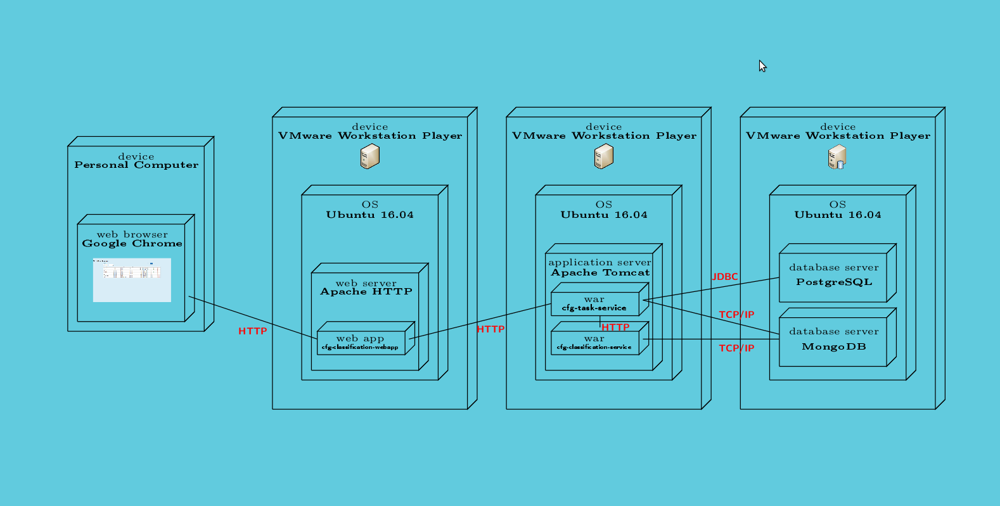

# Canada Food Guide Task Service

This project provides the CFG Task REST Services

## Components and Features

This project uses the following components and features:

* Java       8
* Maven      3.3.9
* Tomcat     8.0  (at the time of this writing, the prescribed HRE tomcat version is 8.0.32)
* MongoDB    3.4.2 LTS
* PostgreSQL 9.5
* Maven
* Git

The availability of the above tools is assumed throughout the instructions on this page.

---

## Add Keycloak libraries to tomcat install

1. Download the OpenID Tomcat client adapters found at:
http://www.keycloak.org/archive/downloads-3.3.0.html at the time of this writing the file was named

	keycloak-tomcat8-adapter-dist-3.3.0.Final.tar.gz

2. Extract the contents of the archive into tomcat's /lib folder e.g. /opt/tomcat/lib

---

## How to build cfg-task-service.war

To deploy the [cfg-task-services], do the following:

1. `cd ~/repositories`
2. `git clone https://github.com/hres/cfg-task-service.git`
3. `cd cfg-task-service`
4. `mvn clean install`
5. copy `target/cfg-task-service.war` to `webapps` directory of [Tomcat 8.0 on HRES]

Similarly for the [cfg-classification-services]:

1. `cd ~/repositories`
2. `git clone https://github.com/hres/cfg-classification-service.git`
3. `cd cfg-classification-service`
4. `mvn clean install`
5. copy `target/cfg-classification-service.war` to `webapps` directory of [Tomcat 8.0 on HRES]

---

## How to Install/Update MongoDB database and collection to the latest and greatest 
1.  Follow the Mongo installation instructions for a Ubuntu install found at:

https://docs.mongodb.com/manual/tutorial/install-mongodb-on-ubuntu/

The following are instructions on setting up a MongoDB database and collection (equivalent of table)

Launch the mongo shell (equivalent to psql or msql) as the mongodb user: sudo -Hu mongodb mongo
Create database: use myNewDB where myNewDB is the Database instance name
Create a collection (think table) and insert some data. The main reason this is done to actually generate the database and collection: db.myNewCollection1.insertOne( { x: 1 } ) where myNewCollection1 is collection name and x is just some random key. db is referring to the database (it is equivalent to self.

Now that MongoDB is up-and-running, copy and rename [mongodb.properties.template] to mongodb.properties (cp mongdb.properties.template mongdb.properties).  Change the `host` and `port` properties in the mongodb.properties file in order to allow the Java API to connect to it.

---

## How to Install/Update PostgreSQL schema/data to the latest and greatest

1. On the command-line run `sudo apt-get install postgresql` to install PostgreSQL
2. On the command-line from the `scripts/sql` directory, run `psql` and login to postgres and ensure you are **not** connected to the `cnfadm` database:
	1. `DROP DATABASE cnfadm;`
	2. `CREATE DATABASE cnfadm;`
	3. `\c cnfadm`
	4. `\i create_table_and_load_data.psql`
3. Copy and rename [db.properties.template] to db.properties (cp db.properties.template db.properties)
4. Change the relevant properties in the db.properties file order to establish connectivity from within Java.

---

## Confirm Service is Running and Connecting to PostgreSQL Database

Run [Test]

## UML Deployment Diagram

[//]: # (These are the references links used in the body of this note and get stripped out when the markdown processor does its thing.  There is no need to format nicely because it should not be seen.)

[install-mongodb-on-ubuntu]:        <https://docs.mongodb.com/manual/tutorial/install-mongodb-on-ubuntu/>
[cfg-task-services]:                <https://github.com/hres/cfg-task-service.git>
[cfg-classification-services]:      <https://github.com/hres/cfg-classification-service.git>
[Tomcat 8.0 on HRES]:               <https://java-dev.hres.ca>
[Test]:                             <https://java-dev.hres.ca/cfg-task-service/service/datasets/status>
[mongodb.properties.template]:      <https://github.com/hres/cfg-task-service/blob/master/src/main/java/ca/gc/ip346/util/mongodb.properties.template>
[db.properties.template]:           <https://github.com/hres/cfg-task-service/blob/master/src/main/java/ca/gc/ip346/util/db.properties.template>
