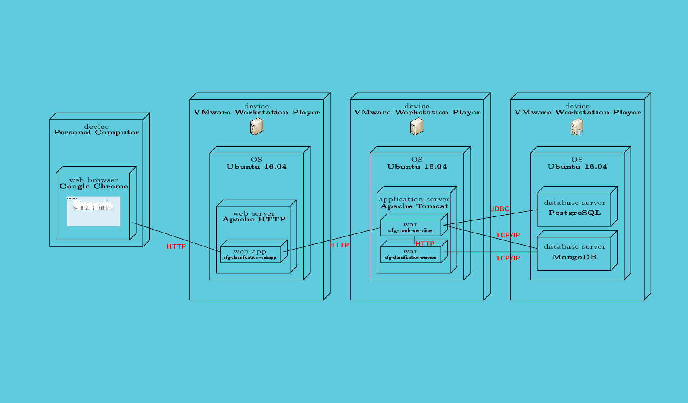

# Canada Food Guide Task Service

This project provides the CFG Task REST Services

## Components and Features

This project uses the following components and features:

* Java       8
* Maven      3.3.9
* Tomcat     8.0  (at the time of this writing, the prescribed HRE tomcat version is 8.0.32)
* MongoDB    3.4.2 LTS
* PostgreSQL 9.5
* Maven
* Git

The availability of the above tools is assumed throughout the instructions on this page.

---

## Add Keycloak libraries to tomcat container

1. Download the OpenID Tomcat client adapters found at:
http://www.keycloak.org/archive/downloads-3.3.0.html at the time of this writing the file was named

	keycloak-tomcat8-adapter-dist-3.3.0.Final.tar.gz

2. Extract the contents of the archive into tomcat's /lib folder e.g. /opt/tomcat/lib

---

## Configure Tomcat HTTPS (and setup certificates)

The instructions for setting up tomcat https and all the certificate scripts are found at:

https://github.com/hres/cfg-classification-keycloak/tree/master/scripts/ssl#how-to-configure-tomcat-for-https

At the time of this writing, the cfg-task-service app expects the tomcat.keystore to be found at /etc/tomcat8/ssl/
If this is not the actual location create a symbolic link to the correct location.

---

## How to build cfg-task-service.war

To deploy the [cfg-task-services], do the following:

1. `cd ~/repositories`
2. `git clone https://github.com/hres/cfg-task-service.git`
3. `cd cfg-task-service`
4. `mvn clean install`
5. `copy` `target/cfg-task-service.war` to `webapps` directory of [Tomcat 8.0 on HRES]

Similarly for the [cfg-classification-services]:

1. `cd ~/repositories`
2. `git clone https://github.com/hres/cfg-classification-service.git`
3. `cd cfg-classification-service`
4. `mvn clean install`
5. `copy` `target/cfg-classification-service.war` to `webapps` directory of [Tomcat 8.0 on HRES]

---

## How to Install/Update MongoDB database and collection to the latest and greatest 
1.  Follow the Mongo installation instructions for a Ubuntu install found at:

	https://docs.mongodb.com/manual/tutorial/install-mongodb-on-ubuntu/

2.  Rename [mongodb.properties.template] to mongodb.properties. It is found in the deployed app under the folder WEB-INF/classes/ca/gc/ip346/util/

---

## How to Install/Update PostgreSQL schema/data to the latest and greatest

1. On the command-line run `sudo apt-get install postgresql` to install PostgreSQL
2. Modify the file `/etc/postgresql/9.5/main/pg_hba.conf`.  Change the entries under "Database administrative login by Unix domain socket" to:
`local`&nbsp;&nbsp;&nbsp;&nbsp;&nbsp;&nbsp;&nbsp;&nbsp;`all`&nbsp;&nbsp;&nbsp;&nbsp;&nbsp;&nbsp;&nbsp;&nbsp;`all`&nbsp;&nbsp;&nbsp;&nbsp;&nbsp;&nbsp;&nbsp;&nbsp;`trust`
3. On the command-line from the projects src/scripts/sql directory, run

	`psql postgres postgres` to login as postgres user

	`DROP DATABASE cfg_db_dev;` (if its already there, use `\l` to check)
	
	`CREATE DATABASE cfg_db_dev;`
	
	`CREATE USER cfg_db_user PASSWORD 'password';`
	
	`\c cfg_db_dev cfg_db_user`
	
	`SET datestyle TO MDY;`
	
	`\i HRE_create_table_and_load_data.psql`
	
	`CTRL-D` to exit
	
4. In the deployed project folder cfg-task-service/WEB-INF/classes/ca/gc/ip346/util/  Copy `db.properties.template` to `db.properties` (`cp db.properties.template db.properties`)
 Verify property settings in the file.

---

## UML Deployment Diagram

[//]: # (These are the references links used in the body of this note and get stripped out when the markdown processor does its thing.  There is no need to format nicely because it should not be seen.)

[install-mongodb-on-ubuntu]:        <https://docs.mongodb.com/manual/tutorial/install-mongodb-on-ubuntu/>
[cfg-task-services]:                <https://github.com/hres/cfg-task-service.git>
[cfg-classification-services]:      <https://github.com/hres/cfg-classification-service.git>
[Tomcat 8.0 on HRES]:               <https://java-dev.hres.ca>
[Test]:                             <https://java-dev.hres.ca/cfg-task-service/service/datasets/status>
[mongodb.properties.template]:      <https://github.com/hres/cfg-task-service/blob/master/src/main/java/ca/gc/ip346/util/mongodb.properties.template>
[db.properties.template]:           <https://github.com/hres/cfg-task-service/blob/master/src/main/java/ca/gc/ip346/util/db.properties.template>
